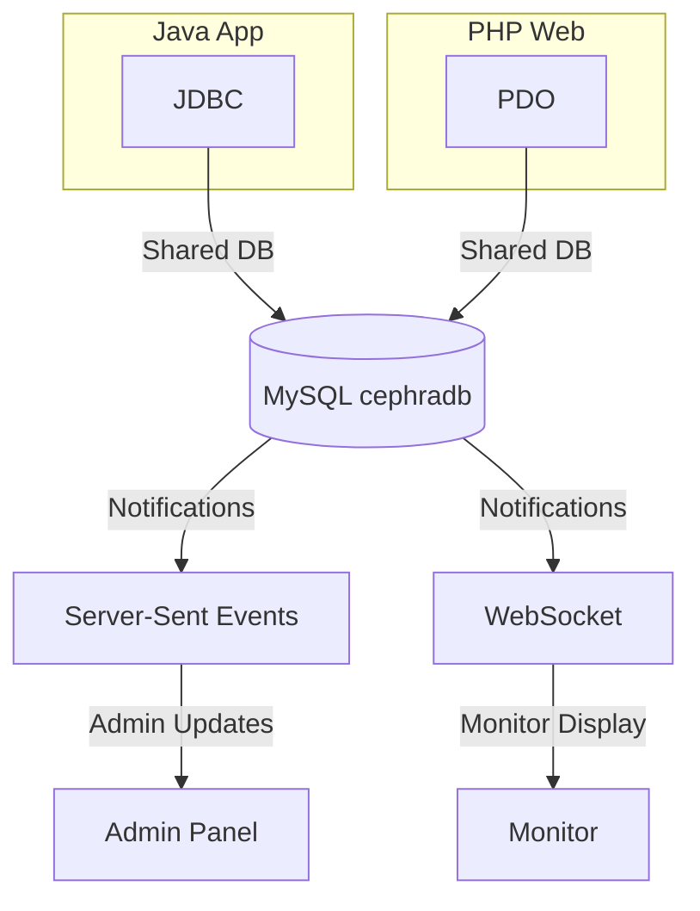

<p align="center">
	
</p>

# <span style="color:#2ecc40;">Cephra QMS</span> — <span style="color:#2980b9;">EV Charging Queue Management System</span>

<p align="center">
	
	
	
	
</p>

<p align="center">
	<b>Cephra</b> is a full-stack EV charging queue management system designed to optimize station operations, reduce wait times, and improve customer flow.
</p>

<p align="center">
	<i>Built as a Data Structures and Algorithms project, it integrates a <b>Java desktop system</b>, a <b>PHP web application</b>, and a <b>shared MySQL database</b> with real-time updates.</i>
</p>

---

## 🚀 TL;DR

<ul>
	<li>⚡ <b>Priority-based EV queue system</b> (low battery first)</li>
	<li>🔄 <b>Real-time updates</b> using WebSocket + SSE</li>
	<li>🖥️ <b>Multi-interface system</b> (Admin, Customer, Monitor)</li>
	<li>🔗 <b>Java + PHP</b> connected directly to one MySQL database</li>
	<li>📈 <b>Designed for scalability</b> and real-world station workflows</li>
</ul>

---

## 📌 Why This Project Matters

> EV infrastructure is growing rapidly, but queue handling at charging stations remains inefficient.

Cephra solves this by:
- 🤖 Automating queue prioritization
- ⏳ Reducing idle bay time
- 👀 Providing real-time visibility for both customers and operators
- 🏭 Simulating a real production environment using multiple systems

---

## 🧩 Features

- ⏱️ <b>Real-time queue management</b> across 8 charging bays
- 🚦 <b>Priority scheduling</b> (battery < 20%)
- ⚡ <b>Automatic bay assignment</b> (Fast / Normal)
- 🖥️ <b>Live station monitor display</b> (TV-ready)
- 📲 <b>Customer queue tracking</b> and charging progress
- 🛠️ <b>Admin dashboard</b> for operations and control
- 🔔 <b>Real-time updates</b> via WebSocket and Server-Sent Events

---

## 🖥️ System Components

<details>
<summary><b>1. Admin Panel (Java Swing)</b></summary>

- 🗂️ Queue management
- 🪫 Bay allocation
- 👨‍💼 Staff and transaction control
- 📊 Real-time monitoring
</details>

<details>
<summary><b>2. Phone Simulator (Java Swing)</b></summary>

- 📱 Simulates customer mobile interface
- ⏳ Queue status and charging progress
</details>

<details>
<summary><b>3. Web Application (PHP)</b></summary>

- 🌐 Customer interface (browser-based)
- 🛡️ Admin dashboard (SSE-powered)
- 🖥️ Monitor display (WebSocket-powered)
</details>

---

## 🛠️ Tech Stack

| Layer            | Technology                                      |
|------------------|------------------------------------------------|
| 🖥️ Desktop App   |  Swing, Maven |
| 🌐 Web Backend   |  PDO |
| 🗄️ Database      |  |
| 🔗 Connection    | HikariCP                                        |
| 🔄 Real-time     | WebSocket (Ratchet), Server-Sent Events         |
| ✉️ Email        | PHPMailer                                       |
| 🎨 Frontend      | HTML, CSS, JavaScript, Bootstrap                |

---

## 🏗️ Architecture

Both Java and PHP systems connect directly to a shared MySQL database.



### Real-Time Flow
- 🛎️ MySQL triggers log updates into a <code>notifications</code> table
- 📢 PHP services read and broadcast updates
- ⚡ Clients receive instant updates without refresh

---

## 🧠 Data Structures & Algorithms

<details>
<summary><b>QueueFlow</b></summary>

- 🏁 Uses <code>PriorityQueue&lt;Entry&gt;</code>
- 🔋 Vehicles with battery < 20% are prioritized
- ⏩ FIFO preserved within same priority
</details>

<details>
<summary><b>BayManagement</b></summary>

- 🪫 Assigns available charging bays dynamically
- ⚡ Supports Fast and Normal chargers
</details>

<details>
<summary><b>ChargingManager</b></summary>

- ⏲️ Uses background <code>Timer</code>
- 🔋 Battery increases 1% per tick
- 🏆 Auto-completes at 100%
</details>

<details>
<summary><b>Ticket Format</b></summary>

- <code>FCH001</code> — Fast charging
- <code>NCH001</code> — Normal charging
- <code>FCHP001</code> / <code>NCHP001</code> — Priority tickets
</details>

---

## 📂 Project Structure

```text
Cephra-QMS/
├── src/main/java/cephra/
│   ├── Admin/
│   ├── Database/
│   ├── Frame/
│   ├── Phone/
│   └── Launcher.java
├── src/main/resources/
├── Appweb/
│   ├── Admin/
│   ├── User/
│   ├── Monitor/
│   └── shared/
└── pom.xml
```

---

## ⚙️ Setup

### Requirements

<ul>
	<li>☕ Java 21+</li>
	<li>🔨 Maven</li>
	<li>🗄️ MySQL 8+</li>
	<li>🐘 PHP (local server like Apache/Nginx)</li>
</ul>

---

### 1. Database Setup

Run:

<pre><code>Appweb/shared/notifications_setup.sql</code></pre>

---

### 2. Configure Web App

Create <code>.env</code> file:

```env
DB_HOST=127.0.0.1
DB_NAME=cephradb
DB_USER=root
DB_PASSWORD=yourpassword
```

---

### 3. Configure Java App

Edit:

<pre><code>src/main/resources/db.properties</code></pre>

Set your database password:

<pre><code>dataSource.password=yourpassword</code></pre>

---

### 4. Run Web App

Serve the <code>Appweb/</code> folder using your PHP server.

---

### 5. Run Java App

```bash
mvn exec:java
```

---

## 🌐 Access

- 👤 <b>Customer:</b> <a href="http://localhost/Cephra/Appweb/User/">http://localhost/Cephra/Appweb/User/</a>
- 🛡️ <b>Admin:</b> <a href="http://localhost/Cephra/Appweb/Admin/">http://localhost/Cephra/Appweb/Admin/</a>
- 🖥️ <b>Monitor:</b> <a href="http://localhost/Cephra/Appweb/Monitor/">http://localhost/Cephra/Appweb/Monitor/</a>

---


---

## 📊 Future Improvements

- 📱 Mobile app (React Native / Flutter)
- 🔗 API layer (Spring Boot REST)
- ☁️ Cloud deployment (AWS / GCP)
- 💳 Payment gateway integration
- 🤖 Predictive queue optimization (AI-based)

---

## 👥 Team

|  | **Usher Kielvin Ponce** | Project Lead, Backend |
|---|----------------------|----------------------|
|  | **Mark Dwayne P. Dela Cruz** | Web UI/UX |
|  | **Dizon S. Dizon** | Backend, Database |
|  | **Kenji A. Hizon** | Java Frontend |

---

## 📄 License

 MIT License
